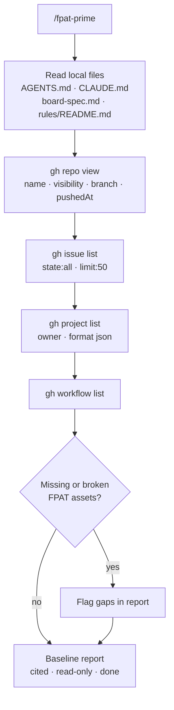

# FPAT Workflow Card — Session Entry (Prime)

## Flow

`/fpat-prime` -> `read AGENTS.md + CLAUDE.md + board-spec.md + rules/README.md` -> `gh repo view` -> `gh issue list --state all` -> `gh project list` -> `gh workflow list` -> `detect missing assets` -> `baseline report < 300 words`

---

## Mermaid

---

## Summary

Read-only baseline capture. Loads local context first, then surveys live GitHub state across repo, issues, board, and workflows. Any broken or missing FPAT asset is flagged before any mutation is allowed. Entry gate for every FPAT session.

---

## Ratings

`SCOUT` · `READ-ONLY` · `BASELINE` · `VERIFY` · `SNAPSHOT` · `GUARD`
