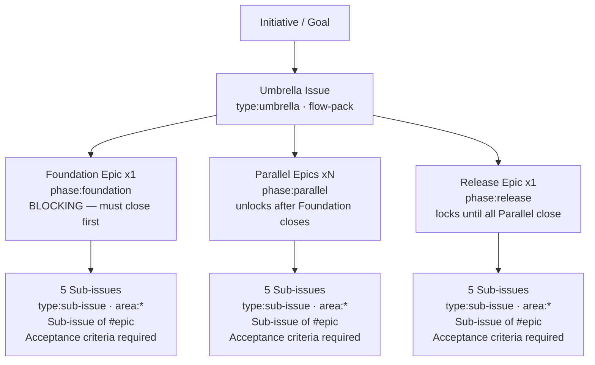

# FPAT Workflow Card — Decomposition (Issue Hierarchy)

## Flow

`initiative` -> `umbrella issue (type:umbrella)` -> `Foundation epic x1 (phase:foundation, BLOCKING)` -> `Parallel epics xN (phase:parallel, unlock after Foundation closes)` -> `Release epic x1 (phase:release, locks until all Parallel close)` -> each epic -> `5 sub-issues (executable, conventional-commit title, Sub-issue of #epic)`

---

## Mermaid

---

## Summary

Maps one multi-week initiative into a phased, GitHub-native issue tree. Foundation is the single blocking gate; Parallel epics run concurrently after it; Release is the final close gate. Sub-issues are the only executable units — all commits and PRs close a sub-issue, never an epic directly. The umbrella + epic layer is proposed by `/fpat-plan-umbrella` (read-only, approval-gated package); each epic's five sub-issues come later from `/fpat-plan-issue <epic-number>` — never all 25 at once.

---

## Ratings

`STRUCTURE` · `PHASE` · `HIERARCHY` · `SEQUENCE` · `ENFORCE` · `CONTROL`
