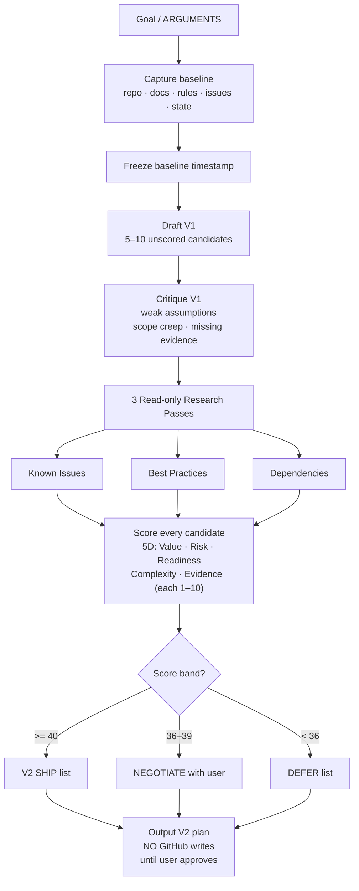

# FPAT Workflow Card — Continuation Planning (V1 → V2)

## Flow

`goal` -> `baseline capture (repo + docs + rules + issues + state)` -> `freeze timestamp` -> `draft V1 (5-10 unscored candidates)` -> `critique (weak assumptions + scope creep + missing evidence)` -> `3 research passes (Known Issues + Best Practices + Dependencies)` -> `5D score (Value + Risk + Readiness + Complexity + Evidence)` -> `bands: >=40 SHIP / 36-39 NEGOTIATE / <36 DEFER` -> `V2 ship list + negotiate list + defer list`

---

## Mermaid

---

## Summary

Turns a vague continuation goal into a scored, research-validated V2 ship list. Three independent research passes attack the naive V1 plan before any score is committed. Score bands create an explicit three-way split: ship, negotiate, or defer. Nothing is written to GitHub until the user approves.

---

## Ratings

`PLAN` · `SCORE` · `RESEARCH` · `NEGOTIATE` · `FILTER` · `VALIDATE`
