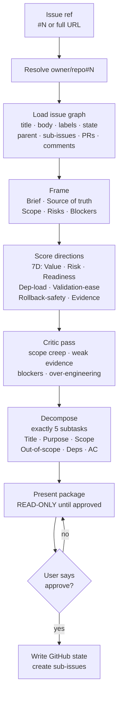

# FPAT Workflow Card — Execution Pipeline (Issue → 5 Subtasks)

## Flow

`issue ref` -> `resolve owner/repo#N` -> `load issue graph (title + body + labels + state + parent + sub-issues + PRs + comments)` -> `frame brief + source of truth + role scope + risks + blockers` -> `score directions (7D: Value + Risk + Readiness + Dep-load + Validation-ease + Rollback-safety + Evidence)` -> `critic pass (scope creep + weak evidence + blockers + over-engineering)` -> `exactly 5 subtasks (Title + Purpose + Scope + AC)` -> `present package` -> `STOP — await "approve"`

---

## Mermaid

---

## Summary

Converts one approved epic into exactly five executable sub-issues. Loads the full issue graph, scores multiple candidate directions on seven dimensions, runs a critic pass for over-scoping, then halts for user approval before any GitHub write. The 5-subtask count is a hard default unless explicitly justified.

---

## Ratings

`PLAN` · `DECOMPOSE` · `CRITIQUE` · `SCORE` · `GUARD` · `EXECUTE`
