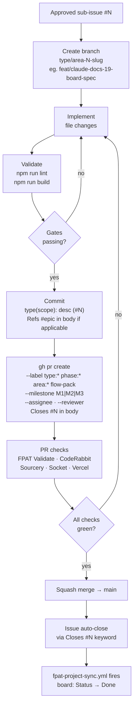

# FPAT Workflow Card — Implementation (Branch → PR → Merge)

## Flow

`approved sub-issue #N` -> `branch type/area-N-slug` -> `implement` -> `npm run lint + npm run build` -> `conventional commit type(scope): desc (#N) + Refs #epic` -> `gh pr create --label --milestone --assignee --reviewer + "Closes #N" in body` -> `PR checks (FPAT Validate + CodeRabbit + Sourcery + Socket + Vercel)` -> `squash merge → main` -> `issue auto-close` -> `fpat-project-sync: board Status → Done`

---

## Mermaid

---

## Summary

The core delivery unit. One branch per sub-issue, validated at lint+build, committed with conventional format, and PR-created with full metadata labels. The `Closes #N` keyword is mandatory — it powers the linked-PR board column and native sub-issue rollup. Squash merge keeps main linear.

---

## Ratings

`BUILD` · `COMMIT` · `VALIDATE` · `DELIVER` · `LINK` · `ENFORCE`
