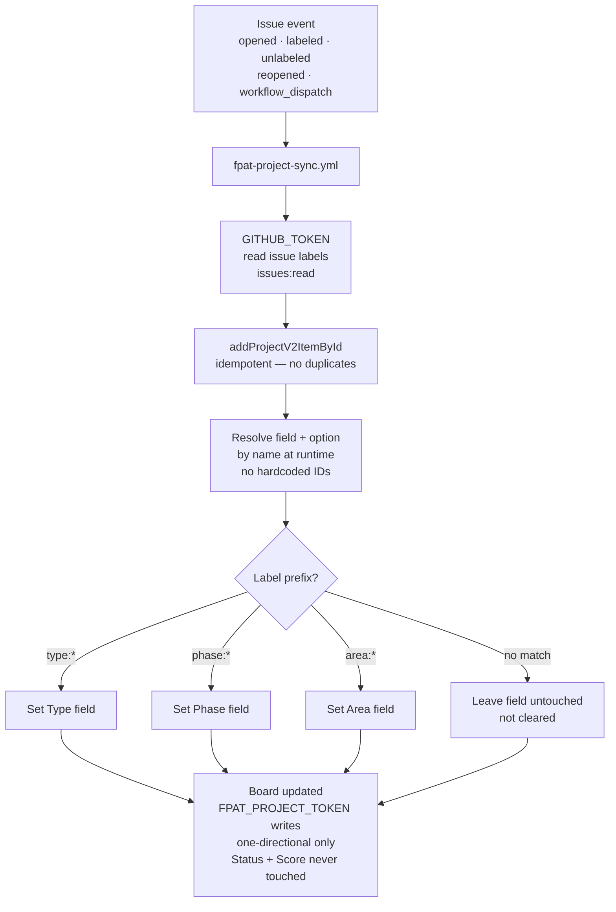

# FPAT Workflow Card — Board Automation (Labels → Fields)

## Flow

`issue event (opened / labeled / unlabeled / reopened)` -> `fpat-project-sync.yml` -> `GITHUB_TOKEN reads labels` -> `addProjectV2ItemById (idempotent)` -> `FPAT_PROJECT_TOKEN writes board via fetch GraphQL` -> `resolve field + option by name at runtime` -> `type:* → Type field` / `phase:* → Phase field` / `area:* → Area field` -> `board updated (one-directional, never Status or Score)`

---

## Mermaid

---

## Summary

Keeps the Project v2 board field values in sync with issue labels automatically. Dual-token model: GITHUB_TOKEN reads, FPAT_PROJECT_TOKEN writes via a raw fetch GraphQL client. Options are resolved by name at runtime — no hardcoded IDs. Strictly one-directional and idempotent; missing labels leave fields untouched rather than clearing them.

---

## Ratings

`SYNC` · `AUTOMATE` · `MAP` · `ONE-WAY` · `IDEMPOTENT` · `WIRE`
