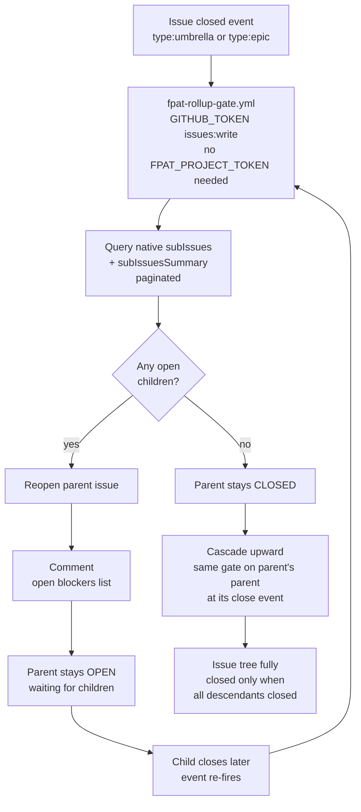

# FPAT Workflow Card — Gate Enforcement (Rollup Gate)

## Flow

`issue close event (type:umbrella OR type:epic)` -> `fpat-rollup-gate.yml` -> `GITHUB_TOKEN issues:write` -> `query native subIssues + subIssuesSummary (paginated)` -> `open children found?` -> `YES: reopen parent + comment blocker list` -> `NO: stay closed` -> `cascade: same gate runs on parent's parent at next close`

---

## Mermaid

---

## Summary

Prevents premature epic or umbrella closure. Detects open sub-issues by querying the native subIssues GraphQL connection, then reopens the parent and comments the blockers. One level deep per run, but cascades automatically since the same gate fires on every close event up the hierarchy. Uses only the default GITHUB_TOKEN — no PAT required. Touches issue state only, never the board.

---

## Ratings

`DEFEND` · `ENFORCE` · `BLOCK` · `GUARD` · `CASCADE` · `REVERT`
