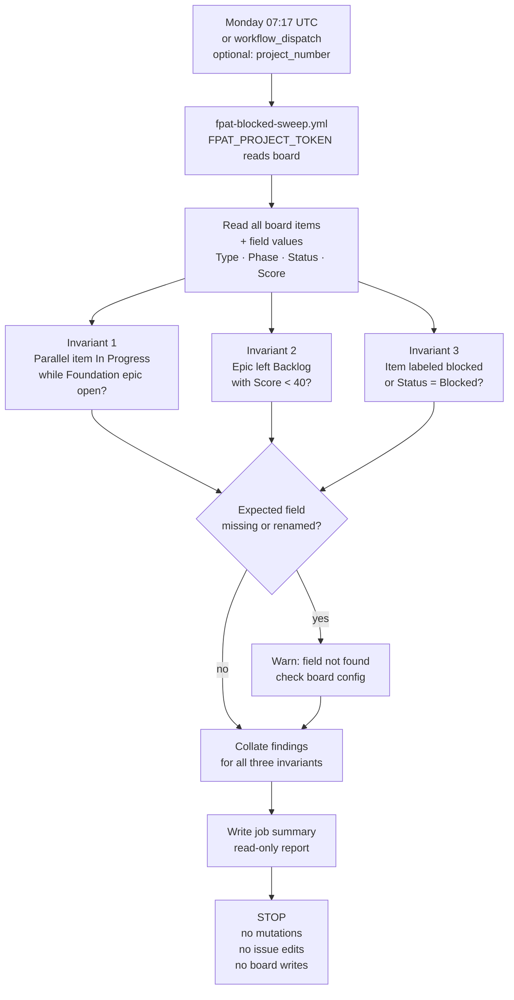

# FPAT Workflow Card — Audit Sweep (Blocked Sweep)

## Flow

`Monday 07:17 UTC / workflow_dispatch (optional project_number)` -> `fpat-blocked-sweep.yml` -> `FPAT_PROJECT_TOKEN reads board items + field values` -> `invariant 1: Parallel started while Foundation epic open?` -> `invariant 2: epic left Backlog with Score < 40?` -> `invariant 3: items labeled blocked or Status = Blocked?` -> `missing/renamed field? → warn` -> `job summary report` -> `STOP — no mutations`

---

## Mermaid

---

## Summary

Weekly invariant audit of the Project v2 board. Surfaces three classes of violations — phase-ordering violations, score gate bypasses, and blocked items — to the job summary. Completely read-only; raises visibility without touching any issue or board state. FPAT_PROJECT_TOKEN is used for reads only.

---

## Ratings

`PATROL` · `AUDIT` · `REPORT` · `READ-ONLY` · `MONITOR` · `ALERT`
