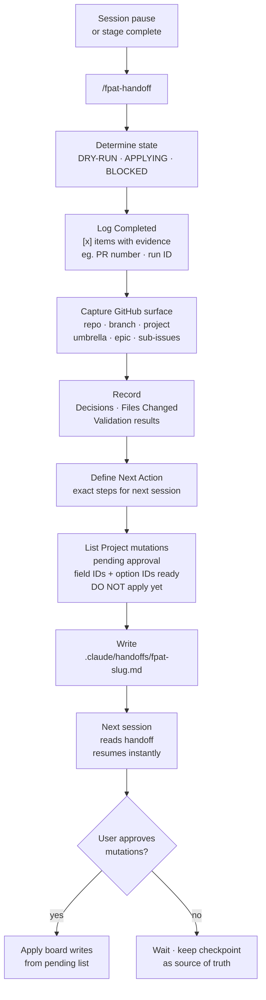

# FPAT Workflow Card — Handoff (Session Checkpoint)

## Flow

`session pause / stage complete` -> `/fpat-handoff <stage>` -> `determine state (DRY-RUN | APPLYING | BLOCKED)` -> `log Completed [x] items with evidence` -> `capture GitHub surface (repo + project + umbrella + epic + sub-issues)` -> `record Decisions + Files Changed + Validation` -> `define Next Action (exact steps)` -> `list Project mutations pending approval (DO NOT apply yet)` -> `write .claude/handoffs/fpat-<slug>.md` -> `next session reads file + resumes instantly`

---

## Mermaid

---

## Summary

Compresses live session state into a resumable checkpoint file. State is one of three explicit modes: DRY-RUN (planning), APPLYING (executing), or BLOCKED (waiting). All pending GitHub board mutations are pre-computed with exact field and option IDs but held until the user explicitly approves each one. The handoff file is the single source of truth for mid-work sessions.

---

## Ratings

`CHECKPOINT` · `COMPRESS` · `PRESERVE` · `RESUME` · `GUARD` · `DOCUMENT`
